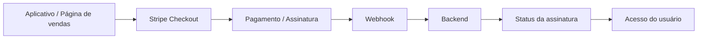

# 🔄 Fluxo de Integração de Pagamentos

Este documento apresenta, de forma simplificada, a arquitetura estudada para integração de pagamentos recorrentes em um produto digital.

## Visão geral

## Responsabilidades

### ✅ Etapa realizada

Preparação e configuração do ambiente de pagamentos:

- Conta empresarial
- Ambiente de produção
- Produto e plano recorrente
- Stripe Checkout
- Payouts
- Permissões e controle de acesso
- Preparação para integração

### 🔵 Próxima etapa — Desenvolvimento

Integração técnica entre a plataforma de pagamentos e o sistema:

- Implementação dos webhooks
- Integração com backend
- Processamento dos eventos
- Atualização do status das assinaturas
- Controle de acesso no aplicativo

## Eventos importantes

Alguns eventos que deverão ser considerados durante a integração:

- Pagamento aprovado
- Pagamento recusado
- Assinatura criada
- Renovação
- Falha na renovação
- Cancelamento
- Expiração

## Perspectiva de QA

O objetivo dos testes será verificar não apenas se o pagamento funciona, mas se todo o sistema permanece consistente.

Um pagamento aprovado deve refletir corretamente no status da assinatura e no acesso do usuário.

Da mesma forma, falhas, cancelamentos e renovações precisam produzir o comportamento esperado em todas as partes da integração.

---

> Este material é destinado a estudo e portfólio. Nenhuma credencial, dado bancário, identificação de cliente ou informação confidencial é utilizada.
